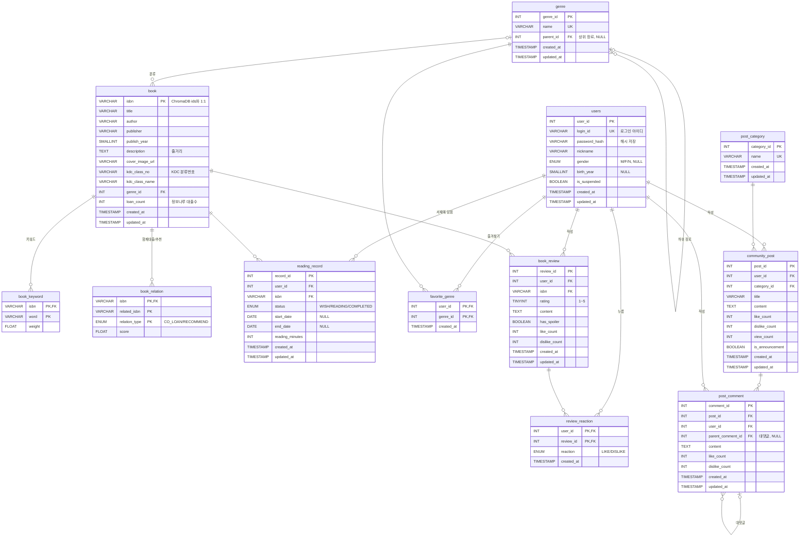

# Read-it DB ERD

> 실제 스키마: [`db/init.sql`](../db/init.sql) — 수정 시 이 파일의 mermaid 블록도 같이 고쳐주세요.

```mermaid
erDiagram
    users {
        INT user_id PK
        VARCHAR login_id UK "로그인 아이디"
        VARCHAR password_hash "해시 저장"
        VARCHAR nickname
        ENUM gender "M/F/N, NULL"
        SMALLINT birth_year "NULL"
        BOOLEAN is_suspended
        TIMESTAMP created_at
        TIMESTAMP updated_at
    }
    genre {
        INT genre_id PK
        VARCHAR name UK
        INT parent_id FK "상위 장르, NULL"
        TIMESTAMP created_at
        TIMESTAMP updated_at
    }
    book {
        VARCHAR isbn PK "ChromaDB ids와 1:1"
        VARCHAR title
        VARCHAR author
        VARCHAR publisher
        SMALLINT publish_year
        TEXT description "줄거리"
        VARCHAR cover_image_url
        VARCHAR kdc_class_no "KDC 분류번호"
        VARCHAR kdc_class_name
        INT genre_id FK
        INT loan_count "정보나루 대출수"
        TIMESTAMP created_at
        TIMESTAMP updated_at
    }
    book_keyword {
        VARCHAR isbn PK,FK
        VARCHAR word PK
        FLOAT weight
    }
    book_relation {
        VARCHAR isbn PK,FK
        VARCHAR related_isbn PK
        ENUM relation_type PK "CO_LOAN/RECOMMEND"
        FLOAT score
    }
    reading_record {
        INT record_id PK
        INT user_id FK
        VARCHAR isbn FK
        ENUM status "WISH/READING/COMPLETED"
        DATE start_date "NULL"
        DATE end_date "NULL"
        INT reading_minutes
        TIMESTAMP created_at
        TIMESTAMP updated_at
    }
    favorite_genre {
        INT user_id PK,FK
        INT genre_id PK,FK
        TIMESTAMP created_at
    }
    book_review {
        INT review_id PK
        INT user_id FK
        VARCHAR isbn FK
        TINYINT rating "1~5"
        TEXT content
        BOOLEAN has_spoiler
        INT like_count
        INT dislike_count
        TIMESTAMP created_at
        TIMESTAMP updated_at
    }
    review_reaction {
        INT user_id PK,FK
        INT review_id PK,FK
        ENUM reaction "LIKE/DISLIKE"
        TIMESTAMP created_at
    }
    post_category {
        INT category_id PK
        VARCHAR name UK
        TIMESTAMP created_at
        TIMESTAMP updated_at
    }
    community_post {
        INT post_id PK
        INT user_id FK
        INT category_id FK
        VARCHAR title
        TEXT content
        INT like_count
        INT dislike_count
        INT view_count
        BOOLEAN is_announcement
        TIMESTAMP created_at
        TIMESTAMP updated_at
    }
    post_comment {
        INT comment_id PK
        INT post_id FK
        INT user_id FK
        INT parent_comment_id FK "대댓글, NULL"
        TEXT content
        INT like_count
        INT dislike_count
        TIMESTAMP created_at
        TIMESTAMP updated_at
    }

    users ||--o{ reading_record : "서재에 담음"
    book ||--o{ reading_record : ""
    users ||--o{ book_review : "작성"
    book ||--o{ book_review : ""
    users ||--o{ review_reaction : "누름"
    book_review ||--o{ review_reaction : ""
    users ||--o{ favorite_genre : "즐겨찾기"
    genre ||--o{ favorite_genre : ""
    genre |o--o{ genre : "하위 장르"
    genre |o--o{ book : "분류"
    book ||--o{ book_keyword : "키워드"
    book ||--o{ book_relation : "함께대출/추천"
    users ||--o{ community_post : "작성"
    post_category ||--o{ community_post : ""
    community_post ||--o{ post_comment : ""
    users ||--o{ post_comment : "작성"
    post_comment |o--o{ post_comment : "대댓글"
```
